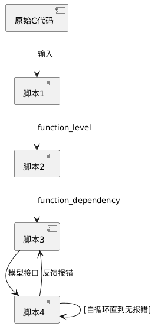

# 毕设第十一周周报（3月19日）

## 本周工作

1.探索现有两种实现路径的可行性：

* 使用`c2rust`构建初始代码，再逐步调整为具有可读性、设计合理的rust实现。
* 使用大模型构建初始代码，再逐步调整为可运行的rust实现。

所做工作：

* 使用`c2rust`构建可运行的代码（之前只是使用c2rust翻译了代码就觉得不合适，并没有得到可运行的结果），并撰写rust代码调用和测试此翻译结果，验证正确性。验证结果为，的确可用，且兼容挂载`littlefs`的存储。
* 查看`libbzip-rs`等项目的工作结果（主要是阅读不同时期的commits记录和文件内容），可以观察到这些项目都是花了以月为单位的时间，上百个commit，才把`c2rust`的结果逐步清理至可用。但是此项目实际上体量和`littlefs`接近，可以说我们的项目本身工作量就不小。

初步结论：除非使用大模型构建初始代码会使自己陷入更深的屎山，陷入比一步步重构更可怕的无尽debug中，否则不应选择从`c2rust`开始工作，工作周期难以接受。

2.探索使用大模型构建尽可能可用的代码，避免陷入无尽的纠错，以至于花费比纯人工重写更多的时间。

所做工作：

* 尝试在上周结果上直接进行人工修正，评估难度。结果是花了一晚上，也只是重写了很有限的一些函数。所遇到的问题包括但不限于：两个有调用关系的函数，对于公共数据的理解和重写方式完全不一致，光是统一参数类型就要花费漫长的时间。不能准确理解具体变量类型，使用不存在的方法或字段。大量五花八门的报错。
* 重新设计翻译的工作流。原有的工作流是：先翻译包括宏、结构体等信息，再把翻译结果和需要翻译的函数一起传入模型接口。新的工作流为：
* 实践并使用claude api完成此工作流。优化后的工作流同等代码量中的报错显著降低，可用性明显提高，一个函数甚至有一小半的概率无需做任何修改。不过最后一段尝试纠错的流程实际上不能做到，仍然需要纯人工介入纠错，AI自我纠错再多遍也不能解决报错。
* 人工介入修复了部分函数（五十余个）的错误，剩余一百多个。

## 下周工作

修复目前存在的故障，使现有代码能够无故障运行，具备`littlefs`的各项功能。
